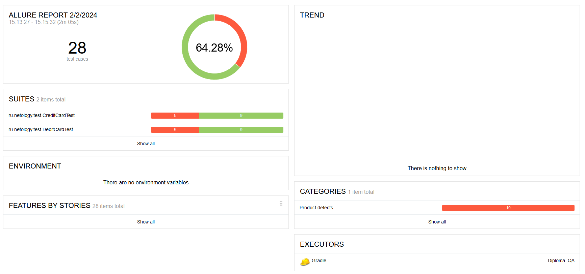

## Отчет по итогам тестирования ##
При выполнении дипломной работы был протестирован функционал веб-сервиса по покупке тура по обычной дебетовой карте и покупке тура в кредит.
В ходе тестирования использовались как позитивные, так и негативные сценарии.

Всего было проведено **28 тестов**, из них:
- успешных - 18;
- неуспешных -10. 

)

По итогам неуспешных тестов обнаружены дефекты в работе приложения и подготовлены баг-репорты в issue к проекту на github.

## Рекомендации ##
1. Устранить [дефекты](https://github.com/Mihi40/Diploma_QA/issues), выявленные в процессе тестирования;
2. Добавить тестовые метки **test-id** для элементов страницы;
3. Составить документацию по проекту с подробным описанием функционала.
